# HAPBDB — Haplotype-Aware Phenotype Based Design Breeding

A Python tool for haplotype clustering and genetic distance visualization from VCF (Variant Call Format) files. HAPBDB performs unsupervised hierarchical clustering on samples using Hamming distance over one-hot encoded haplotypes, then generates publication-quality visualizations: cluster-colored dendrograms, pairwise heatmaps (unlabeled and labeled versions), PCA projections with the extreme accessions highlighted, haplotype base tables with dedicated indel/SV colors, and a simulated haplotype–phenotype boxplot. When extreme-phenotype accessions are specified, it automatically finds the minimum distance threshold that separates them — directly informing breeding selection decisions.

The project includes two versions:

| Version | Script | Use case |
|---------|--------|----------|
| **Single-trait** | `HAPBDB.py` | One VCF, one trait, one pair of extreme accessions |
| **Multi-trait** | `multi_traits_HAPBDB/multi_traits_HAPBDB.py` | Multiple traits, each with its own VCF and extreme accessions, merged into a breeding selection matrix |

---

## Single-trait HAPBDB

### How It Works

1. **VCF parsing** — Converts each sample's genotype calls (`0/0`, `0/1`, `1/1`) into a flattened one-hot encoding per variant, producing a sample × (variants × 3) matrix. In parallel, genotypes are decoded to nucleotide bases for human-readable base table output.

2. **Hamming distance** — Computes the pairwise Hamming distance matrix across all samples. Samples with similar haplotype profiles have lower distances.

3. **Hierarchical clustering** — Builds a linkage matrix via average-linkage agglomerative clustering and renders a dendrogram whose branch colors encode cluster membership: each cluster below the separation threshold is drawn in its own colorblind-safe color, identical to the cluster IDs in the `*_extram_based.txt` files.

4. **Threshold search** (when `--e1acc` and `--e2acc` are provided) — Sweeps thresholds from 1.0 down to 0.01 until the two extreme accessions land in different clusters. This threshold is the minimum genetic distance needed to separate favorable from unfavorable phenotypes — a data-driven cutoff for breeding decisions.

5. **PCA overview** — Projects the one-hot haplotype matrix onto its top two principal components. Each sample is plotted as a point colored by its cluster (same cluster colors as the dendrogram), and the extreme accessions e1/e2 are highlighted with distinct markers and ID labels.

6. **Haplotype–phenotype boxplot** — Draws the phenotype distribution per haplotype cluster. Two data sources:
   - **Observed phenotypes** (recommended): provide a two-column file (`sample_id` + value, tab/space/comma separated, header allowed) via `--phenotype-file`; the boxplot then uses your real measurements and writes `{prefix}_{phenotype}_phenotype.txt`.
   - **Simulated phenotypes** (fallback, no file given): each sample's phenotype is interpolated between two **anchor accessions** based on its Hamming distance to them (anchors are fixed at their known values, small Gaussian noise is added). Configure with `--phenotype` (trait name) and `--anchors` (`acc:value,acc:value`); defaults: `Days to flowering`, anchors `W24` = 20 (early) and `CGN22692` = 60 (late). If an anchor is absent from the data, `--e1acc`/`--e2acc` are used instead (e1 = 20, e2 = 60), and the table is written to `{prefix}_{phenotype}_simulated_phenotype.txt`.

7. **Visualizations** — Generates publication-quality PDF figures: dendrogram, PCA, pairwise distance heatmaps (labeled + unlabeled), phenotype boxplot, haplotype base table and the combined tree + base table view, plus all tabular outputs.

### Example output

The figures below were generated from the demo dataset (`demo_data/demo.vcf`, 80 samples × 80 variants) with `--e1acc CGN22050 --e2acc CGN22692`:

| Dendrogram | Haplotype PCA (e1/e2 marked) | Labeled distance heatmap |
|------------|------------------------------|--------------------------|
| 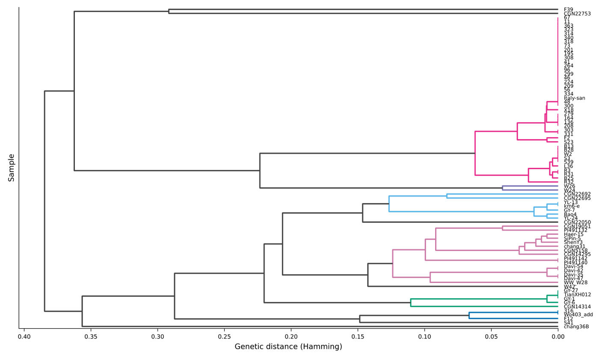 | 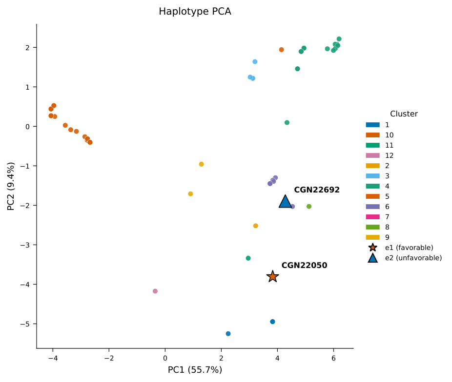 | 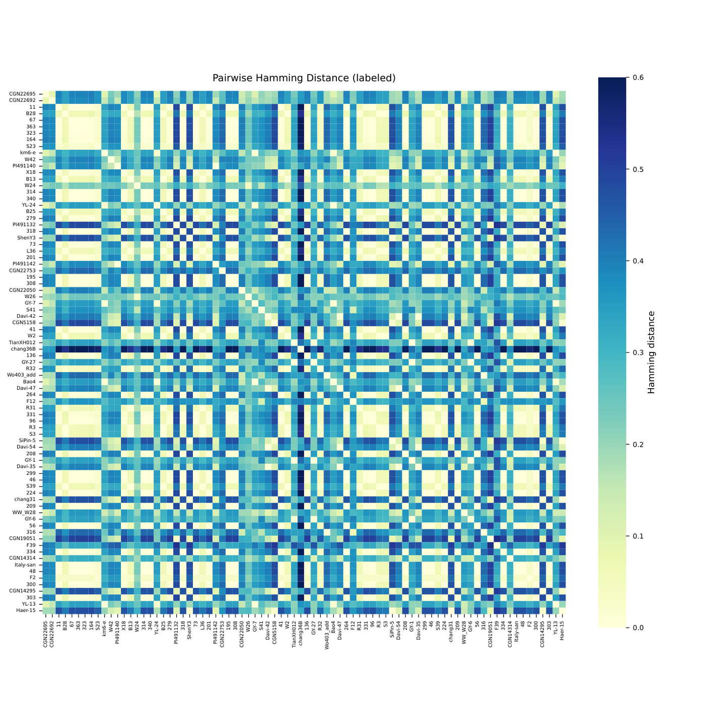 |

An unlabeled, publication-style version of the heatmap is also written as `{prefix}_Pairwise_Hamming_Distanced_Heatmap.pdf`.

| Representative haplotype base table | Dendrogram + base table (combined) | Days to flowering by haplotype cluster |
|-------------------------------------|------------------------------------|----------------------------------------|
| 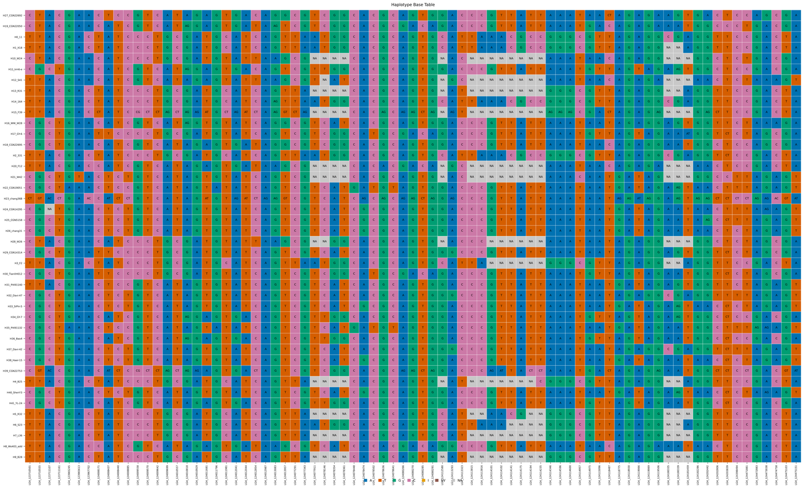 | 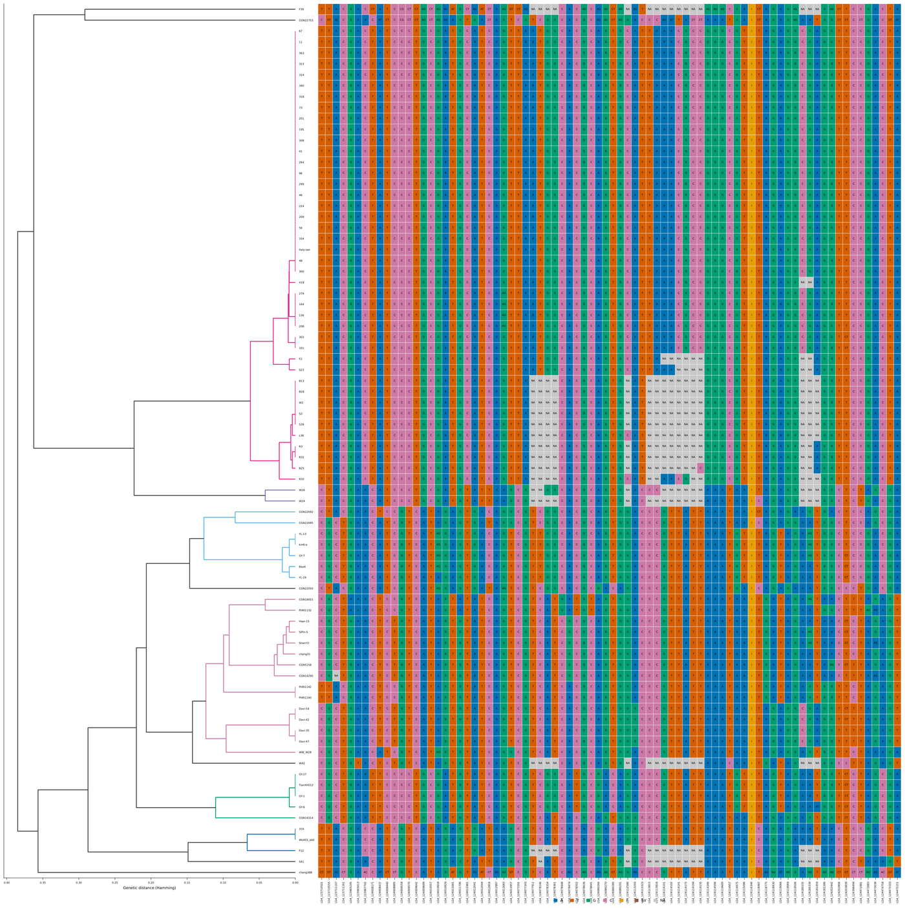 | 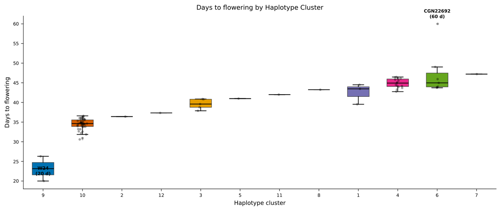 |

### Output files

| File | Description |
|------|-------------|
| `{prefix}_distance_matrix.npy` | Pairwise Hamming distance matrix (NumPy) |
| `{prefix}_linkage_matrix.npy` | Hierarchical clustering linkage matrix (NumPy) |
| `{prefix}_sample_ids.txt` | Sample IDs in analysis order |
| `{prefix}_strict_all_hap.txt` | Per-sample cluster assignment from unsupervised clustering |
| `{prefix}_tree_base_dis1_haplotype.txt` | Cluster membership at distance threshold = 1.0 |
| `{prefix}_tree_dist{threshold}_extram_based.txt` | Cluster membership at the separation threshold |
| `{prefix}_hap_base_full_table.txt` | Full base-level genotype table (samples × variants) |
| `{prefix}_tree_dendrogram.pdf` | Hierarchical clustering dendrogram (branches colored by cluster) |
| `{prefix}_PCA.pdf` | PCA projection of haplotypes, colored by cluster, with e1/e2 highlighted |
| `{prefix}_{phenotype}_boxplot.pdf` | Phenotype per haplotype cluster (anchors annotated), e.g. `{prefix}_days_to_flowering_boxplot.pdf` |
| `{prefix}_{phenotype}_phenotype.txt` | Sample phenotype table (sample × cluster × value) — observed mode (`--phenotype-file`) |
| `{prefix}_{phenotype}_simulated_phenotype.txt` | Sample phenotype table (sample × cluster × value) — simulated mode (no `--phenotype-file`) |
| `{prefix}_Pairwise_Hamming_Distanced_Heatmap.pdf` | Pairwise distance heatmap (unlabeled, publication style) |
| `{prefix}_Pairwise_Hamming_Distanced_Heatmap_labeled.pdf` | Pairwise distance heatmap with sample-ID labels |
| `{prefix}_hap_base_table.pdf` | Representative haplotype base table |
| `{prefix}_tree_with_base_table.pdf` | Side-by-side dendrogram and base table |

### Usage

```bash
python HAPBDB.py <vcf_file> [--e1acc ID] [--e2acc ID] [--prefix PREFIX] [--max_reps N] [--phenotype NAME] [--anchors acc:value,acc:value] [--phenotype-file FILE]
```

| Argument | Required | Default | Description |
|----------|----------|---------|-------------|
| `pop_vcf` | Yes | — | Path to input VCF file |
| `--e1acc` | No | `None` | Favorable extreme accession ID |
| `--e2acc` | No | `None` | Unfavorable extreme accession ID |
| `--prefix` | No | `result` | Prefix for all output files |
| `--max_reps` | No | *n_clusters* | Max representative haplotypes in base table plot |
| `--phenotype` | No | `Days to flowering` | Phenotype name for the boxplot (used in axis labels and output filenames) |
| `--anchors` | No | `W24:20,CGN22692:60` | Anchor accessions and their phenotype values (simulation only), format `acc:value,acc:value` |
| `--phenotype-file` | No | `None` | Two-column phenotype file (`sample_id` value; tab/space/comma separated, header allowed). When provided, the boxplot uses these **observed** values instead of simulating |

**Examples:**
```bash
# Default demo: flowering time simulated from W24 (20 d) and CGN22692 (60 d)
python HAPBDB.py QTL1.vcf --e1acc CGN22050 --e2acc CGN22692 --prefix my_analysis

# Custom phenotype and anchors, e.g. plant height (cm)
python HAPBDB.py QTL1.vcf --e1acc CGN22050 --e2acc CGN22692 --prefix my_analysis \
    --phenotype "Plant height (cm)" --anchors "CGN22050:90,CGN22692:40"

# Observed phenotypes from your own file (two columns: sample_id, value)
python HAPBDB.py QTL1.vcf --e1acc CGN22050 --e2acc CGN22692 --prefix my_analysis \
    --phenotype "Days to flowering" --phenotype-file my_phenotypes.txt
```

---

## Multi-trait HAPBDB

`multi_traits_HAPBDB/multi_traits_HAPBDB.py` extends the single-trait pipeline to handle **multiple traits simultaneously**. Each trait has its own VCF file and pair of extreme accessions. After per-trait clustering and threshold detection, it merges all results into a unified breeding selection framework.

### Key additions over single-trait

#### Cophenetic distance scoring

For each trait, every sample receives a score in **[-100, +100]** based on its cophenetic distance to the two extreme accessions:

- **+100** — genetically identical to the favorable extreme (e1)
- **-100** — genetically identical to the unfavorable extreme (e2)
- **0** — equidistant, or beyond the e1–e2 distance

The score quantifies how favorable each sample's haplotype is for each trait.

#### Breeding selection matrix

Scores from all traits are combined into a single DataFrame. Each sample gets:

- Per-trait score columns (`{trait}_score`)
- A `total_score` column (sum of all trait scores)

Samples are ranked by total score — highest first — so breeders can identify lines that perform well across all target traits.

#### Breeding report (`{prefix}_breeding_report.txt`)

A structured text report containing:

1. **Per-trait summary** — extreme accession scores, count of positive/negative/zero samples
2. **Ranked sample table** (top 40) — per-trait scores and total, sorted descending
3. **Top breeding lines** — samples with the maximum total score
4. **Complementary cross recommendations** — pairs of lines that maximize combined trait coverage (one may be strong on trait A while the other is strong on trait B), identified by scanning the top 100 candidates

#### Breeding matrix heatmap (`{prefix}_breeding_matrix.pdf`)

A colorblind-safe blue-white-red diverging heatmap (ColorBrewer RdBu) of the top 100 samples × all traits, with a sidebar bar chart showing each sample's average score. Blue = favorable, red = unfavorable.

> **Publication-ready styling:** all figures use colorblind-safe palettes — Okabe-Ito colors for allele base tables (A/T/G/C SNPs plus dedicated colors for indels and SVs), the colorblind-safe RdBu diverging scheme for score heatmaps — suitable for high-impact journals.

#### Example output

From the multi-trait demo (`multi_traits.sh`, 3 traits × 100 samples):

| Breeding matrix heatmap (top 100 samples × 3 traits) | Per-trait dendrogram (trait t1) |
|------------------------------------------------------|--------------------------------|
| 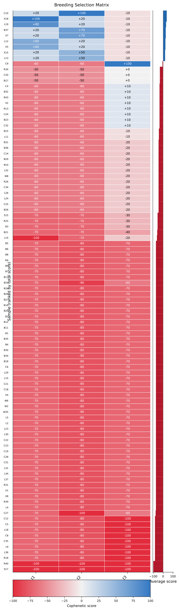 | 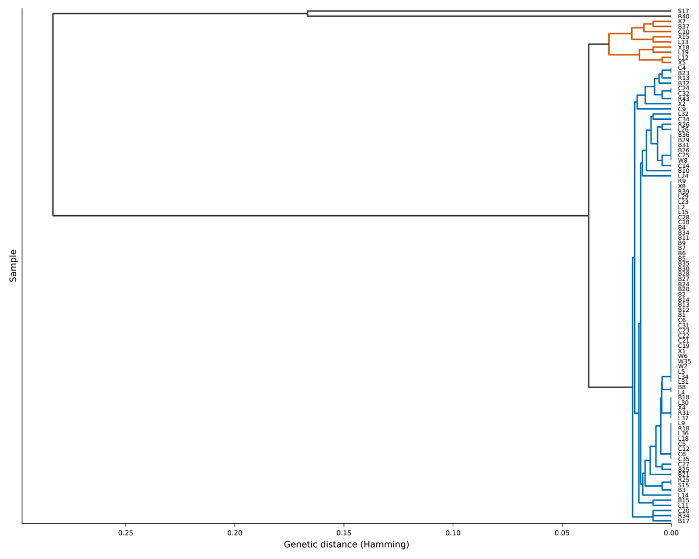 |

Per-trait PCA, phenotype boxplots, heatmaps and base tables are also produced for each trait, e.g.:

| t1 haplotype PCA (e1/e2 marked) | t1 flowering-time boxplot | t1 labeled distance heatmap | t1 haplotype base table |
|---------------------------------|---------------------------|-----------------------------|-------------------------|
| 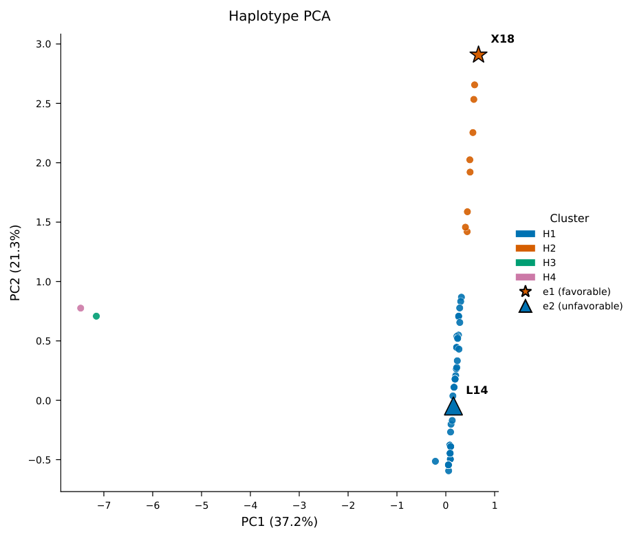 | 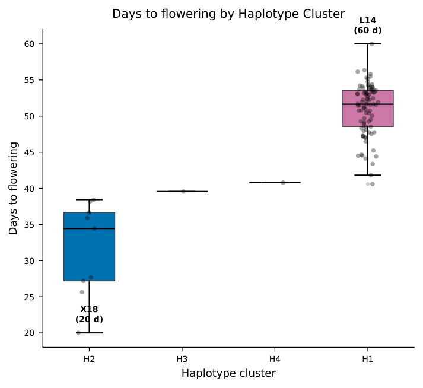 | 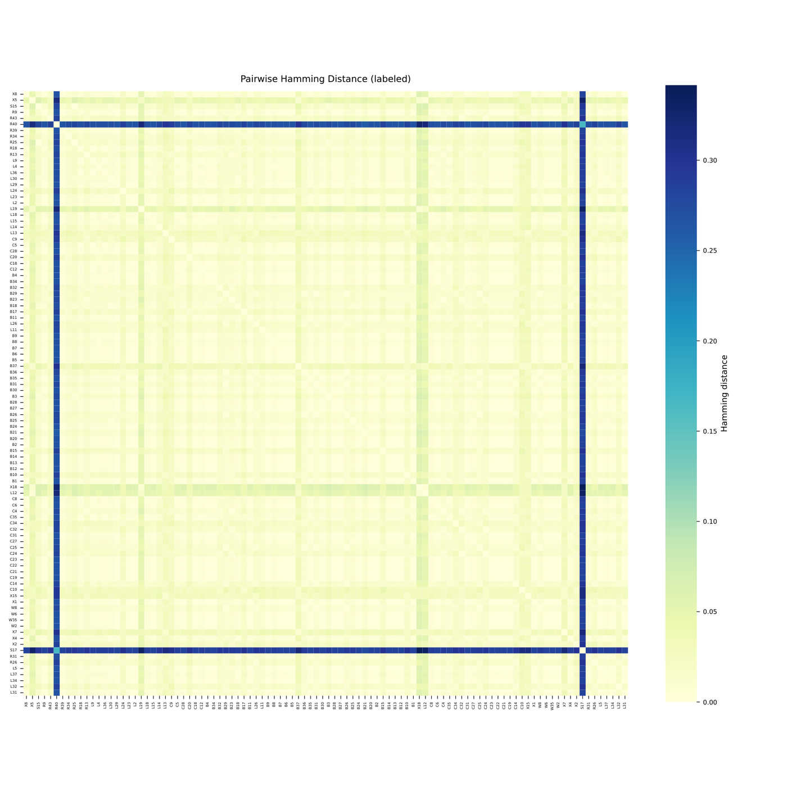 | 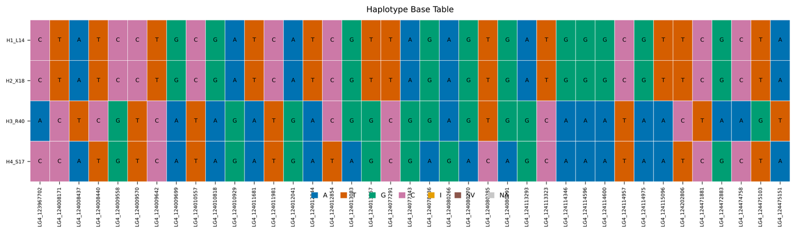 |

### Usage

```bash
python multi_traits_HAPBDB.py \
    --trait t1:QTL_trait1.vcf,e1_acc,e2_acc \
    --trait t2:QTL_trait2.vcf,e1_acc,e2_acc \
    --prefix results/multi
```

Each `--trait` argument has the format `name:vcf,e1,e2` and can be repeated for as many traits as needed.

| Argument | Description |
|----------|-------------|
| `--trait name:vcf,e1,e2` | Define one trait (repeat for each trait) |
| `--prefix` | Output prefix (directory paths allowed) |
| `--phenotype` | Phenotype name for the boxplot (default: `Days to flowering`) |
| `--anchors` | Anchor accessions and phenotype values for simulation (default: `W24:20,CGN22692:60`); per-trait `e1`/`e2` (e1 = 20, e2 = 60) are used as fallback when the anchors are not in a trait's VCF |
| `--phenotype-file` | Two-column observed-phenotype file (`sample_id` value) applied to all traits; without it phenotypes are simulated per trait |

**Backward compatible:** You can also call it with a single VCF and `--e1acc`/`--e2acc` like the single-trait version.

### Multi-trait output files

Everything from single-trait (per trait, prefixed `{prefix}_{trait_name}_*`, including PCA and the phenotype boxplot) plus:

| File | Description |
|------|-------------|
| `{prefix}_breeding_report.txt` | Ranked sample scores, top lines, cross recommendations |
| `{prefix}_breeding_matrix.pdf` | Score heatmap across all samples and traits |

### Multi-trait example

```bash
cd multi_traits_HAPBDB
bash multi_traits.sh
```

Runs 3 traits (`t1`, `t2`, `t3`) each from a 100-sample × 80-variant VCF with different extreme accession pairs, generating per-trait visualizations plus the breeding report and heatmap under `demo_data_out/`.

---

## Requirements

- Python 3.6+
- numpy ≥ 1.18, pandas ≥ 1.0, scikit-learn ≥ 0.22, scipy ≥ 1.4
- matplotlib ≥ 3.1, seaborn ≥ 0.10
- pycairo ≥ 1.19 (optional; falls back to matplotlib's PDF backend)

```bash
pip install -r requirements.txt
```

---

## Project Structure

```
HAPBDB/
├── HAPBDB.py                      # Single-trait analysis pipeline
├── run.sh                         # Entry point → runs example.sh
├── example.sh                     # Single-trait demo
├── requirements.txt               # Python dependencies
├── figures/                       # Example output images (used in this README)
├── demo_data/
│   ├── extract_demo_vcf.py        # Extracts demo VCF from QTL1.vcf
│   └── demo.vcf                   # 80 samples × 80 variants (includes CGN22050, CGN22692 & W24)
├── demo_out/                      # Single-trait demo outputs
├── multi_traits_HAPBDB/
│   ├── multi_traits_HAPBDB.py     # Multi-trait pipeline with breeding scores
│   ├── multi_traits.sh            # Multi-trait demo (3 traits)
│   ├── demo_data/
│   │   ├── QTL_trait1_100.vcf     # 100 samples × 80 variants
│   │   ├── QTL_trait2_100.vcf
│   │   └── QTL_trait3_100.vcf
│   └── demo_data_out/             # Multi-trait demo outputs
└── QTL1.vcf / QTL2.vcf            # Full source VCFs
```

## Use Case

HAPBDB is designed for **marker-assisted breeding programs**:

- Given QTL-associated VCF files and accessions at opposite trait extremes, identify the genetic distance threshold that separates favorable from unfavorable haplotypes.
- Base table visualizations show which specific SNP alleles distinguish the clusters — SNPs are colored A/T/G/C, indels (`I`, orange) and structural variants (`SV`, brown) get their own colors — helping breeders choose crosses that break undesirable linkages.
- The PCA projection and the haplotype–phenotype boxplot provide an intuitive overview of population structure and of how haplotype clusters track a target trait.
- The multi-trait version ranks breeding lines across multiple target traits simultaneously and recommends complementary cross pairs.

## License

MIT License.

## Citation

If you use HAPBDB in your research, please cite:

> Tu, Z., Luo, G., Xiao, L., Wei, M., Zhang, J., & Wang, X. A haplotype-based breeding framework for the precise pyramiding of elite QTL alleles: a lettuce case study.
> DOI: [https://doi.org/10.64898/2026.08.12.744550](https://doi.org/10.64898/2026.08.12.744550)
